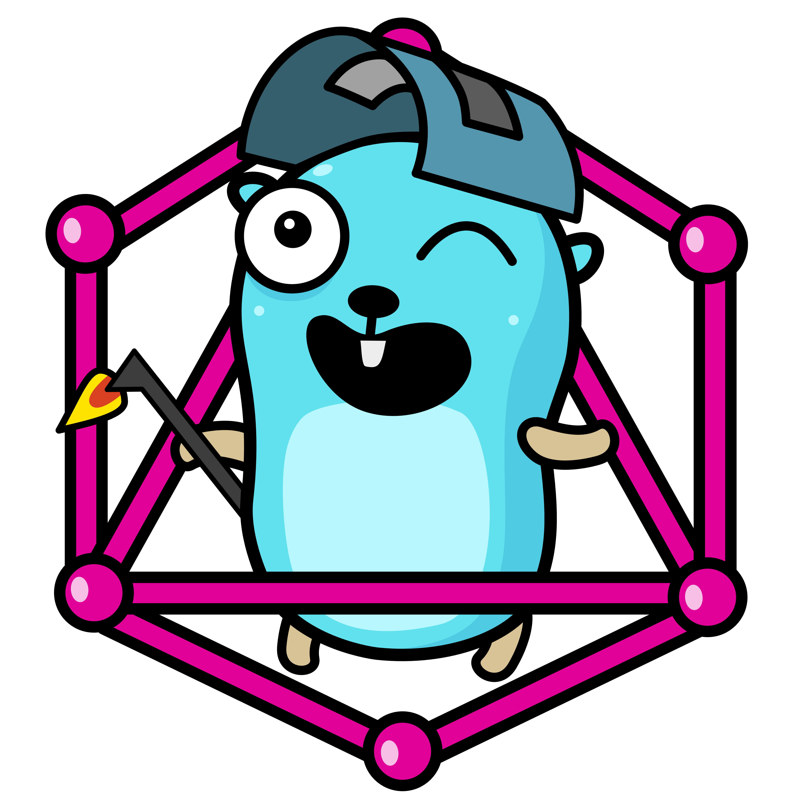

# Hati

<p align="center" width="100%">

</p>
<p align="center" width="100%">
<strong>Build distributed applications with Hati</strong>
</p>

```text
Project is in development - it is not advisable to use it in production at this stage.

Feel free to play around and leave feedback :)
```

## What is that?

**Hati** gives you - out of the box - layer of communication for your distributed application or api, it has couple of integrations with different protocols which can be used for building your next project.

These integrations are:

- [x] Redis
- [ ] RabbitMQ
- [ ] P2P Protocol

Hati server works on a simple concept of modules and actions (methods) - they can receive payloads through internal channels from other Hati servers which are in the network, as well as through HTTP requests in case if your are building api.

Hait comes with few handy integrations for different databases:

- [ ] MySQL
- [ ] PostgreSQL
- [ ] SQLite
- [ ] BadgerDB
- [ ] CouchDB
- [ ] MongoDB

## How does that work?

I'll tell you later :-)

---

### Useful commands

```
go build -gcflags="-m" main.go
```
